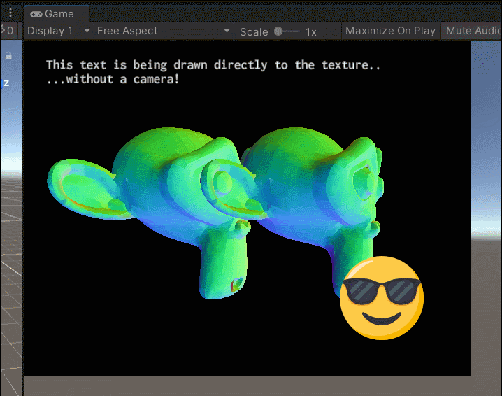

# RTUtils

[SCRIPT](../Runtime/RTUtils.cs)

RenderTexture utilities for directly drawing meshes, text or textures (sprites) onto a render texture without a camera, and converting to Texture2D.



### Why?

Typically, rendering to an off-screen texture in Unity is done via a second camera to which you apply a rander texture as a target. However, in the quite common case when you wish to draw simple things, like a few quads, text or a simple unlit mesh, a full Unity camera has an uncecessary overhead, which includes culling, batching, drawing shadows, sorting geometry, etc. This is especially true in HDRP, where the upfront cost of camera rendering is especially high.

## How to render without a camera

### Setting up

To start rendering, a capture matrix needs to be setup, which defines the type and location of the "fake camera". You can do this by picking one of the following functions:
- `rt.BeginOrthoRendering()` to start drawing an orthographic view within a 0-1 space
- `rt.BeginPixelRendering()` to start drawing an orthographic view within a space defined by texture resolution. So, a 512x512 render texture will have positions from 0 to 512
- `rt.BeginPerspectiveRendering()` to start drawing a perspective view, providing it fov, camera position and rotation and optionally near and far planes
- `rt.BeginRendering()` to start drawing with a custom perspective-view matrix

IMPORTANT: Once you start rendering, you must not forget to end it with `rt.EndRendering()`

### Drawing

In between the `rt.BeginXXXRendering()` and `rt.EndRendering()` functions, you can call any of the GL functions (for example `GL.Clear(true, true, Color.black)` to clear the texture), or you can use any of the following:

#### Meshes

Use `rt.DrawMesh(text, position, size)` to draw TMPText meshes. 

#### Sprites

You can also draw a simple texture in a rect with 

#### TMP Text

Use `rt.DrawTMPText(text, position, size)` to draw TMPText meshes. 

Note that you will need to setup your TMPText object before you draw it:
- The position of the text drawn on texture depends on the TMPText's pivot, anchor and alignment. For example, you might want to make a non-UI based TMPText, and put the anchor to lower left and alignment to left bottom. This will render the text from the `position` parameter and to the above-right direction;
- TMPText's character size also matters. It will be multiplied with the `size` parameter in `DrawMesh()` function, so that you can more easily draw multiple meshes per frame with the same TMPText object;
- If you want to set the text string right before rendering it, know that TMP will wait for the end of frame to update the actual mesh. Hence you need to manually force it to change text immediately. You can do that by using `text.ForceMeshUpdate(true, true);` after you set the text, and before you render it to the texture.
- Note that the function will use the currently set material to TMPText. But it doesn't scale SDF-antialiasing properly, so you'll need to tweak the smoothing parameter in the SDF material to get the right antialiasing for the right font size.

## Example

```
using Nothke.Utils;

...

rt.BeginPerspectiveRendering(60, new Vector3(0, 0, -2.5f), Quaternion.identity);
{ // scope is not required, but looks nicer :)

    GL.Clear(true, true, Color.black);

    Quaternion rotation = Quaternion.Euler(0, Time.time * 100, 0);

    rt.DrawMesh(monkeMesh, testMaterial,
        Matrix4x4.TRS(new Vector3(-0.5f, 0, 0), rotation, Vector3.one));

    rt.DrawMesh(monkeMesh, testMaterial,
        Matrix4x4.TRS(new Vector3(0.5f, 0, 0), rotation, Vector3.one));
}
rt.EndRendering(); // Ends perspective rendering

rt.BeginOrthoRendering();
{
    rt.DrawTMPText(text, new Vector2(0.05f, 0.95f), 0.3f);

    rt.DrawSprite(texture, new Rect(0.7f, 0.1f, 0.2f, 0.2f * rt.Aspect()));
}
rt.EndRendering(); // Ends ortho rendering
```

### Why not use CommandBuffers?

In some of my tests with CommandBuffers, they turned out to be slower to execute than just simply calling GL functions. The difference is that RTUtils functions (currently) execute on the main thread, while using the CommandBuffers executes in a separate rendering thread. However, you still need to setup the buffer in the main thread, and there is some overhead for the execution as well. So if you just want to draw a couple of meshes, calling them on the main thread turns out to be faster.

However, if you wish to render a lot more meshes onto a RenderTexture, using CommandBuffers is a the way to go, but I feel that if you want to use them, you should write them yourself, here is an example to get you started:

```
using UnityEngine.Rendering;

...

CommandBuffer cb = new CommandBuffer();

cb.SetRenderTarget(myRenderTexture);
cb.SetProjectionMatrix(Matrix4x4.Ortho(0, 1, 0, 1, -100, 100));
cb.ClearRenderTarget(true, true, Color.black);

// You can also draw a renderer, but an automatic transform update will be run before it:
cb.DrawRenderer(testRenderer, testMaterial);

// Render a mesh:
cb.DrawMesh(mesh, transform.localToWorldMatrix, testMaterial);

// Render text:
Matrix4x4 textMatrix = Matrix4x4.TRS(new Vector3(0, 1), Quaternion.identity, Vector3.one);
cb.DrawMesh(text.mesh, textMatrix, text.materialForRendering, 0, 0);

...

Graphics.ExecuteCommandBuffer(cb);
```